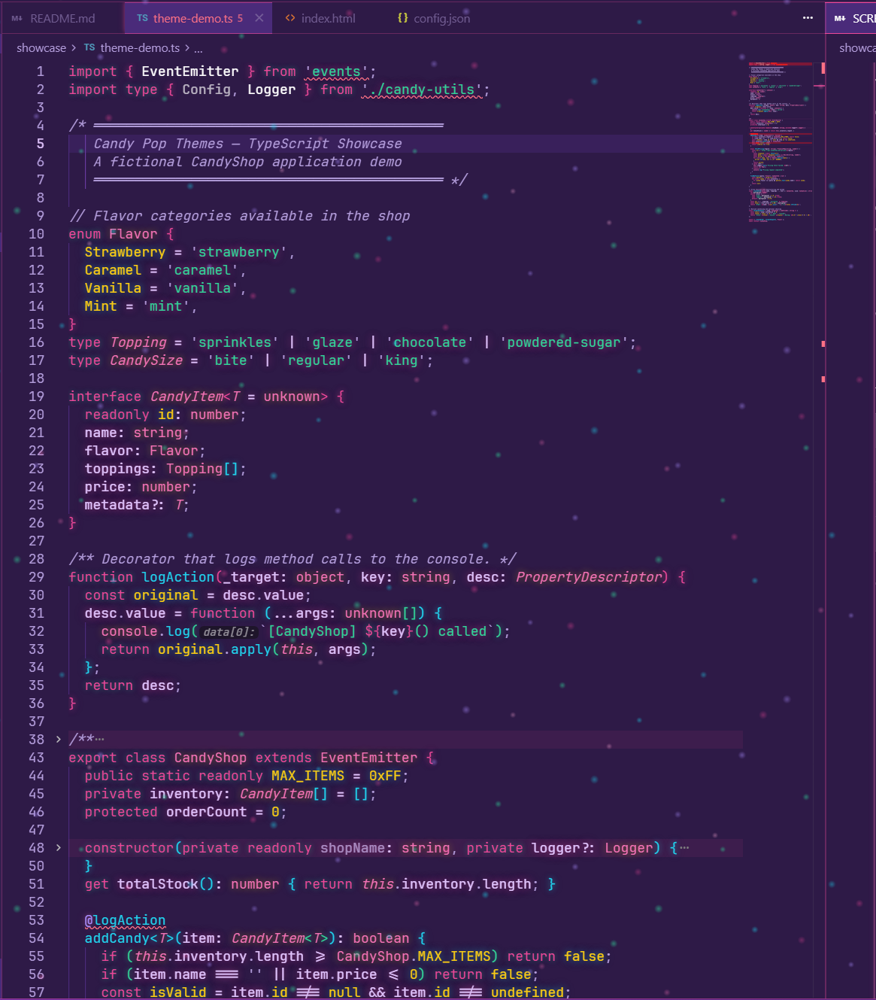
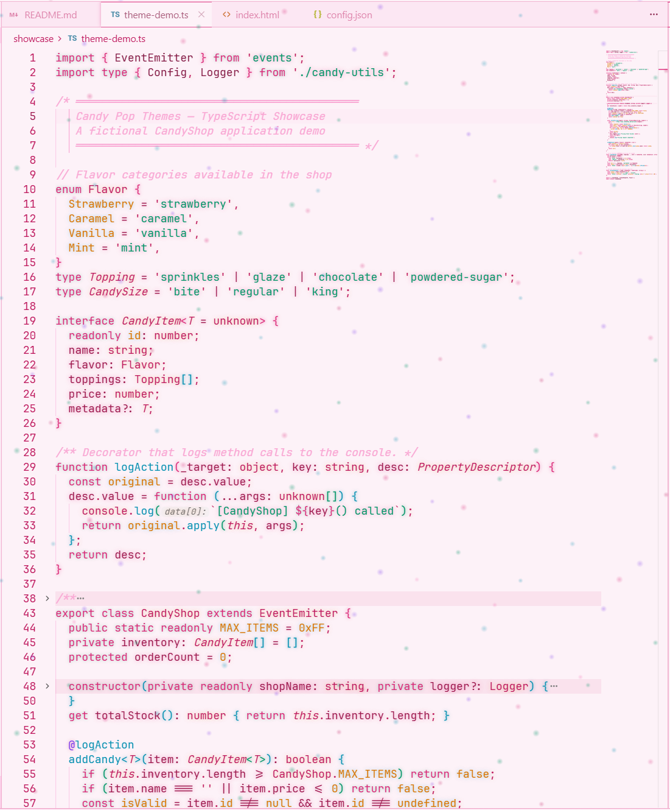

# Candy Pop Themes

Vibrant pink, purple & cyan color themes for VS Code and Cursor with optional neon glow effects, floating sparkle particles, animated gradients, and glassmorphism.




## Themes

| Theme | Style | Effects |
|-------|-------|---------|
| **Candy Pop** | Dark | Glow, sparkles, glassmorphism, animated status bar |
| **Light Candy Pop** | Light | Glow, sparkles, glassmorphism, animated status bar |
| **Candy Pop Clean** | Dark | Colors only, no effects |
| **Light Candy Pop Clean** | Light | Colors only, no effects |

## Features

### Neon Glow Effects
- Breathing cursor glow with pulse animation
- Syntax token glow on keywords, functions, strings, types, decorators, and more
- Glowing bracket pairs with per-depth colors
- Selection halo glow
- Active tab and button glow

### Floating Sparkle Starfield
- ~390 CSS-only sparkle dots across two layers (pink/magenta + cyan/violet)
- Gentle drift and twinkle animations
- GPU-accelerated with `will-change` hints

### Glassmorphism
- Frosted glass effect on sidebar, bottom panel, command palette, and autocomplete
- Semi-transparent backgrounds with backdrop blur

### Animated Status Bar
- Smooth gradient shift animation across the status bar
- Dark theme: deep purple gradient
- Light theme: soft pink gradient

### Additional Effects
- Activity bar icon glow on active/hover
- Badge glow on notification badges
- Scrollbar glow on hover
- Minimap decoration glow
- Editor group border glow
- Focus ring glow

## Installation

### From the Marketplace
1. Open **Extensions** sidebar (`Ctrl+Shift+X` / `Cmd+Shift+X` on macOS)
2. Search for **Candy Pop Themes**
3. Click **Install**
4. Open the Command Palette (`Ctrl+Shift+P` / `Cmd+Shift+P` on macOS) and select **Preferences: Color Theme**
5. Choose **Candy Pop**, **Light Candy Pop**, **Candy Pop Clean**, or **Light Candy Pop Clean**

### From VSIX
```bash
code --install-extension candy-pop-themes-x.x.x.vsix
# or for Cursor:
cursor --install-extension candy-pop-themes-x.x.x.vsix
```

## Enabling/Disabling Effects

Effects (glow, sparkles, glassmorphism, animated gradient) are **automatically enabled** when you select the **Candy Pop** or **Light Candy Pop** themes, and **automatically removed** when you switch to any other theme.

You can also manually control them:
- `Ctrl+Shift+P` (`Cmd+Shift+P` on macOS) > **Candy Pop: Enable Glow & Effects**
- `Ctrl+Shift+P` (`Cmd+Shift+P` on macOS) > **Candy Pop: Disable Glow & Effects**

> **Note**: Effects require modifying the workbench HTML file. You may need to run your editor as Administrator on Windows. After enabling/disabling, a reload is required.

> **Note**: The "Clean" variants (**Candy Pop Clean** and **Light Candy Pop Clean**) provide the same color palette without any effects injection.

## Screenshots


*Candy Pop (Dark) - Full effects*


*Light Candy Pop - Full effects*

## Color Palette

### Dark Theme (Candy Pop)
| Element | Color |
|---------|-------|
| Primary Pink | `#ec4899` |
| Cyan | `#22d3ee` |
| Green | `#34d399` |
| Yellow | `#facc15` |
| Violet | `#a78bfa` |
| Rose | `#f472b6` |

### Light Theme (Light Candy Pop)
| Element | Color |
|---------|-------|
| Primary Pink | `#db2777` |
| Teal | `#0891b2` |
| Emerald | `#059669` |
| Amber | `#d97706` |
| Violet | `#7c3aed` |
| Rose | `#be185d` |

## Requirements

- VS Code 1.80+ or Cursor
- Administrator access (for effects injection on Windows)

## Known Issues

- After editor updates, the effects injection may be overwritten. Simply reload or switch themes to re-apply.
- The "Corrupted Installation" warning is expected after effects are injected. This is safe and can be dismissed.

## Contributing

Contributions are welcome! Please open an issue or PR.

## License

[MIT](LICENSE)
